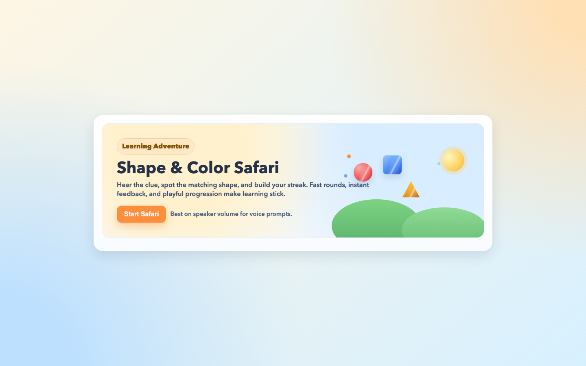
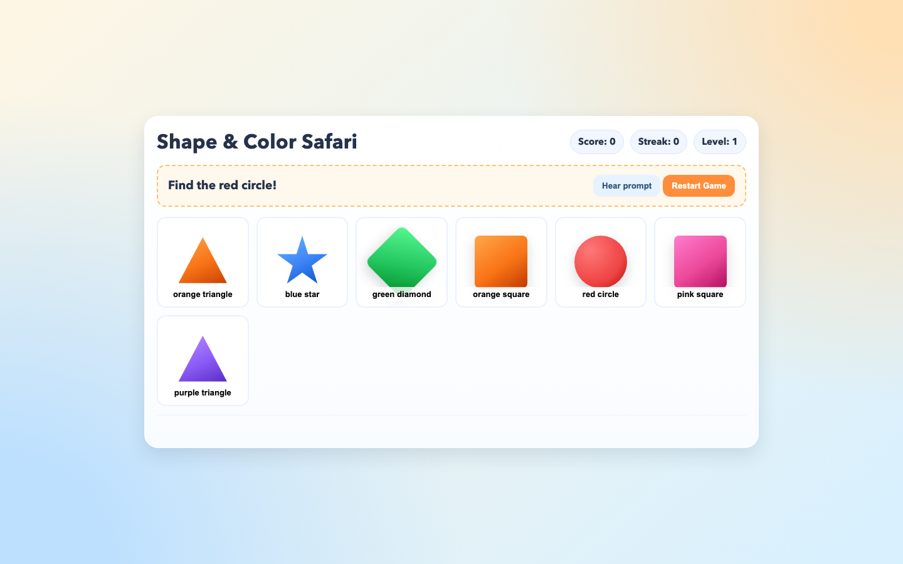

# Shape & Color Safari

A playful browser game to help kids learn **shapes** and **colors** through quick rounds, voice prompts, and instant feedback.

## Preview

### Start Screen



### Gameplay



## Features

- Interactive rounds with prompts like `Find the red circle!`
- Click/tap matching shape cards
- Score, streak, and level progression
- Correct/wrong feedback with animations
- Speech synthesis prompt playback (`Hear prompt`)
- Responsive UI for desktop and mobile
- Attractive start screen with animated `Start Safari` button

## Tech Stack

- HTML
- CSS
- Vanilla JavaScript

No build tools or dependencies required.

## Run Locally

From the project folder:

```bash
python3 -m http.server 4173
```

Open:

- http://127.0.0.1:4173/index.html

## Gameplay

1. Click `Start Safari`.
2. Listen to or read the clue.
3. Tap the matching color + shape card.
4. Continue rounds to increase streak and level.

## Project Structure

- `index.html` - complete app (markup, styling, logic)
- `README.md` - project documentation
- `preview/start-screen.png` - screenshot of start screen
- `preview/gameplay.png` - screenshot of gameplay

## Customization

You can update these in `index.html`:

- `SHAPES` array to add/remove shape types
- `COLORS` array to change color palette
- scoring/level logic in `onTileClick()` and `newRound()`
- speech rate/pitch in `speak()`

## Notes

- Voice depends on browser and OS speech synthesis support.
- Best experience with sound enabled.
